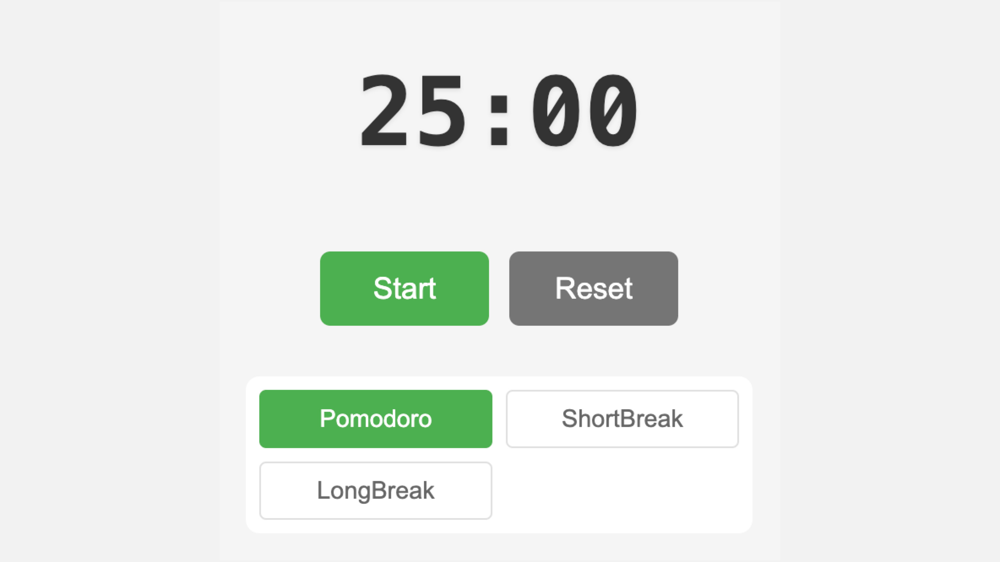

# Exercise: Pomodoro Timer



## Learning Goals

Upon completing this exercise, you will be able to:

- Master React's `useEffect` hook for handling side effects
- Manage intervals and cleanup in React components
- Integrate with browser APIs
- Implement data persistence with localStorage

## Introduction

Ever wondered how those productivity apps keep you focused and on track? Today, you're stepping into the shoes of a productivity app developer to create your very own Pomodoro Timer!

The Pomodoro Technique, named after those cute tomato-shaped kitchen timers (pomodoro means tomato in Italian), is a time management method that uses timed intervals of focused work followed by short breaks. It's simple, yet powerful - work for 25 minutes, take a 5-minute break, and after 4 "pomodoros", take a longer 15-minute break.

But here's the exciting part: you're not just building any timer. You're creating a smart, React-powered timer that remembers your preferences, notifies you when it's time for a break, and even updates your browser tab to show your progress.

We've provided you with the visual components and styling - your mission is to bring this timer to life using React's powerful `useEffect` hook. You'll handle everything from the ticking clock to updating the browser title, making this timer not just functional, but genuinely helpful for users.

Ready to make time work for you? Let's dive in!

## Getting Started

Follow the instructions below to get started:

1. Fork this Repository
2. Clone the Repository to your computer
3. Open the Repository in VS Code
4. Start the Live Server in VS Code
5. Follow instructions

## Instructions

You got everything you need to get started with this exercise. We'll guide you through the process step-by-step, ensuring you understand each component and its functionality. Let's begin with the basic timer functionality and gradually build up to a fully-featured Pomodoro Timer.

### Task 1: Basic Timer Functionality

Start by connecting the event handlers in each component (`onStartStop`, `onReset`, `onPresetChange`).

Next, create the first `useEffect` hook and implement the timer logic.

This hook should handle the countdown functionality, updating the timer every second when it's running. Remember to clean up the interval when the component unmounts or when the timer stops.

Here's a basic structure to get you started:

```jsx
useEffect(
  () => {
    let intervalId

    if (isActive && timeLeft > 0) {
      // Implement interval logic here
    }

    return () => {
      // Cleanup logic here
    }
  },
  [
    /* Add appropriate dependencies */
  ]
)
```

Make sure to update the timer state and handle the transition between work and break periods.

By the end of this task, you should have a functional timer that can start, stop, and reset. The timer should accurately count down and switch between work and break periods. This forms the foundation of your Pomodoro Timer, on which we'll build additional features in the following tasks.

### Task 2: Browser Title Updates

Now that we have a working timer, let's make it more user-friendly by updating the browser tab title to reflect the current timer status. This will allow users to see their timer progress even when they're in a different tab.

Use the `document.title` property to dynamically update the browser tab title. Create a new `useEffect` hook that changes the title based on the current timer state. For example, when the timer is running, you could display the remaining time and whether it's a work or break period.

<aside>
ℹ️

Yes, you can have several `useEffect` hooks in a single component. Each hook can handle a different aspect of your component's functionality. In this case, we'll use one hook for the timer logic and another for updating the browser title.

</aside>

Here's a basic structure to get you started:

```jsx
useEffect(() => {
  document.title = `${formatTime(timeLeft)} - ${
    isBreak ? "Break" : "Work"
  } | Pomodoro Timer`

  return () => {
    document.title = "Pomodoro Timer" // Reset title when component unmounts
  }
}, [timeLeft, isBreak])
```

Ensure that the title updates every second along with the timer, and reverts to a default title when the timer is not active or when the component unmounts.

<aside>
ℹ️

`isBreak` is not implemented yet, figure this out on your own, or ignore the `isBreak` part of the code.

</aside>

### Task 3: State Persistence

To enhance the user experience and make our Pomodoro Timer more persistent, let's implement state persistence using `localStorage`.

Start by creating a new `useEffect` hook that saves the current timer state to localStorage whenever it changes. Then, implement another hook that loads the saved state when the component mounts.

Here's a basic structure to get you started:

```jsx
// Save state to localStorage
useEffect(() => {
  localStorage.setItem(
    "pomodoroState",
    JSON.stringify({
      timeLeft,
      isActive,
      isBreak,
      workDuration,
      breakDuration,
    })
  )
}, [timeLeft, isActive, isBreak, workDuration, breakDuration])

// Load state from localStorage
useEffect(() => {
  const savedState = JSON.parse(localStorage.getItem("pomodoroState"))
  if (savedState) {
    // Update your state with the saved values
  }
}, [])
```

If you implement this correctly, your Pomodoro Timer will remember its state even if the user refreshes the page or closes and reopens the browser. This feature adds a layer of convenience and continuity to the user experience.

### Task 4: Timer Completion

When the timer reaches zero, you need to handle two main tasks: alerting the user and resetting the timer.

Make sure to:

1. Reset the timer to the appropriate break duration
2. Show an `alert` to notify the user when it's time to switch between work and break periods

Implement this logic within your existing timer effect or create a new effect specifically for handling timer completion.

## Submission

When you’ve completed the exercises:

1. Run the following commands:

```jsx
git add .
git commit -m "Completed Pomodoro Timer exercise"
git push origin main
```

1. Create a Pull Request and submit your assignment below:

<Submission>

Please provide a link to the Pull Request you’re created for the exercise.

## Bonus Challenges

If you finish early, or you want to push your skills further, here are some bonus challenges to explore:

### Task 5 (Optional): Play Audio

Enhance your Pomodoro Timer by adding audio alerts.

Implement a feature that plays a sound when the timer reaches zero, signaling the end of a work or break period. This auditory cue will help users stay on track even if they're not actively watching the timer. You can use the HTML5 Audio API to play a short, pleasant sound file when the timer completes.

We’ve added a `bell-single-ring.mp3` file under `/src/assets` that you can use.

Here's a basic example of how you might implement this audio feature:

```jsx
const audio = new Audio("/src/assets/bell-single-ring.mp3")

// Play the sound when the timer reaches zero
if (timeLeft === 0) {
  audio.play()
}
```

Remember to adjust the volume and ensure the audio file is correctly referenced in your project structure.

### Task 6: Keyboard Shortcuts

Implement keyboard shortcuts to enhance user control over the timer.

Add functionality for starting/stopping the timer with the spacebar, resetting with `r`, and toggling between work and break periods with `t`.

To implement this, you'll need to add a new useEffect hook that listens for keydown events on the document.

Here's a basic structure to get you started:

```jsx
useEffect(
  () => {
    const handleKeyPress = (event) => {
      if (event.code === "Space") {
        // Toggle start/stop
      } else if (event.code === "KeyR") {
        // Reset timer
      } else if (event.code === "KeyT") {
        // Toggle between work and break
      }
    }

    document.addEventListener("keydown", handleKeyPress)

    return () => {
      document.removeEventListener("keydown", handleKeyPress)
    }
  },
  [
    /* Add appropriate dependencies */
  ]
)
```

## Questions and Answers

<details>
<summary>How can I ensure the timer continues to run accurately even when the browser tab is not active?</summary>
To ensure accurate timing even when the tab is inactive, you can use the Date object to calculate elapsed time instead of relying solely on setInterval. Here's an approach:
  1. Store the start time of the timer using Date.now()
  2. In your interval callback, calculate the elapsed time by comparing the current time with the start time
  3. Update the timer based on this elapsed time rather than decrementing by a fixed amount
     This method compensates for any delays or inconsistencies that may occur when the tab is inactive.
</details>

<details>
<summary>Why is it important to clean up the interval in the `useEffect` hook?</summary>
  Cleaning up the interval in the useEffect hook is crucial for several reasons:
  1. Prevents memory leaks: If the interval isn't cleared when the component unmounts, it will continue to run in the background, potentially causing unexpected behavior or performance issues.
  2. Avoids multiple intervals: Without cleanup, each re-render could potentially create a new interval, leading to multiple timers running simultaneously.
  3. Ensures accuracy: When the component's state or props change, cleaning up allows you to reset the interval with the updated values, maintaining the timer's accuracy.
  Always include a cleanup function in your useEffect hook when dealing with timers, event listeners, or any other side effects that need to be managed over time.
</details>
